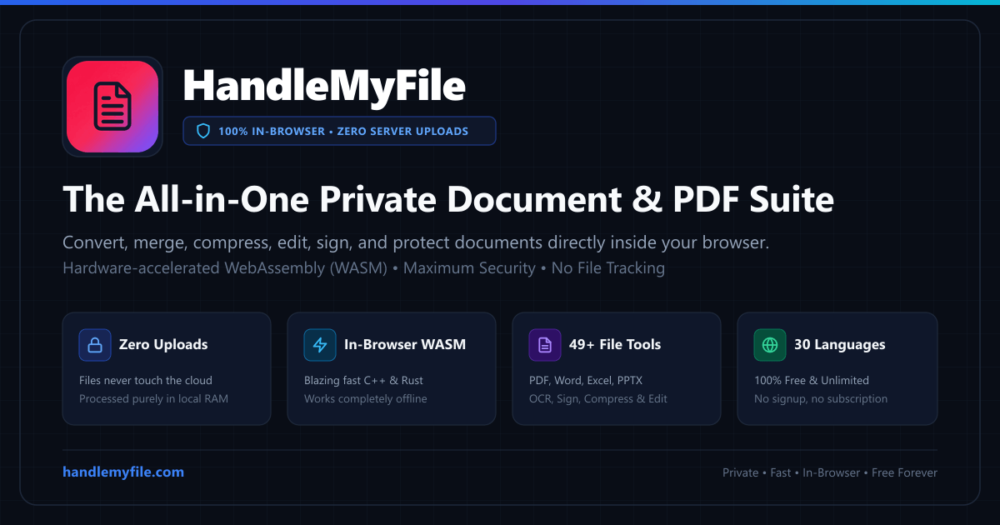

# 🔒 HandleMyFile — 100% Private, Client-Side WebAssembly Document Platform

<p align="center">
  
</p>

<p align="center">
  <a href="https://handlemyfile.com" target="_blank" rel="noopener"></a>
  <a href="https://codesbykhairannoor.github.io/checkmyfile/" target="_blank" rel="noopener"></a>
  
  
  
  
  
</p>

---

### 🌐 Official Platforms & Deployment
- **Official Production Platform**: [https://handlemyfile.com](https://handlemyfile.com) (All 49+ tools, 30 languages, zero limits)
- **Live GitHub Pages Satellite**: [https://codesbykhairannoor.github.io/checkmyfile/](https://codesbykhairannoor.github.io/checkmyfile/) (Interactive Client-Side Engine Showcase)
- **Open-Source Client Repository**: [github.com/codesbykhairannoor/checkmyfile](https://github.com/codesbykhairannoor/checkmyfile)

---

## ⚡ The Predatory Document SaaS Problem
For the past decade, the multi-billion-dollar document software industry (Adobe Acrobat, DocuSign, SmallPDF, iLovePDF) has operated on a broken cloud paradigm:

1. **The Surveillance & Privacy Risk**: Users are forced to transmit confidential tax audits, contracts, medical records, and bank statements across the internet to remote third-party cloud buckets with unverified retention policies.
2. **The Artificial Monetization Chokehold**: Charging $20 to $40/month or throttling users with *"2 free tasks per day"* limits for operations that consume less than 20 milliseconds of local CPU time.
3. **The Hostage-Ware Model**: Allowing users to upload and configure a file, only to spring a subscription modal when clicking the download button.

---

## 🛡️ The Technological Solution: [HandleMyFile](https://handlemyfile.com)

**HandleMyFile** completely bypasses the cloud. The entire document processing pipeline is compiled into **client-side WebAssembly (WASM)** and executed directly inside the user's local browser memory (`ArrayBuffer` & `Uint8Array`).

> 🚀 **The True Air-Gap Test**: Open [https://handlemyfile.com](https://handlemyfile.com), activate **Airplane Mode** (disconnect Wi-Fi entirely), and compress, merge, split, or e-sign a 100-page document. It executes 100% offline. Zero network packets leave your machine.

---

## 📊 Comprehensive Benchmark: HandleMyFile vs Legacy SaaS

| Metric / Feature | **HandleMyFile** | Adobe Acrobat Pro | iLovePDF / SmallPDF | DocuSign |
| :--- | :---: | :---: | :---: | :---: |
| **Server Uploads** | **0 Bytes (100% In-RAM)** | ❌ Required for cloud | ❌ Uploads to AWS | ❌ Uploads to cloud |
| **Annual Price** | **$0 (Free Forever)** | ❌ $239.88 / year | ❌ $84.00 / year | ❌ $480.00 / year |
| **Daily File Limits** | **Unlimited** | ❌ Trial paywall | ❌ 2 tasks / day | ❌ Document caps |
| **Air-Gap / Offline Mode** | **Native (Browser RAM)** | ⚠️ Bloated desktop install | ❌ Web-only (Needs WAN) | ❌ Online only |
| **Mandatory Sign-up** | **None** | ❌ Required | ❌ Required for Pro | ❌ Required |
| **Data Retention Liability** | **Zero (Unhackable)** | ⚠️ Cloud vulnerability | ⚠️ S3 bucket leaks | ⚠️ Third-party storage |

---

## 🛠️ Complete Toolset Matrix (49+ Utilities)

| Category | Concrete Tools Available Live | Core Engine Architecture |
| :--- | :--- | :--- |
| **PDF Core Operations** | [Merge PDF](https://handlemyfile.com/merge-pdf), [Split PDF](https://handlemyfile.com/split-pdf), [Reorder Pages](https://handlemyfile.com/reorder-pdf), [Crop Margins](https://handlemyfile.com/crop-pdf), [Rotate](https://handlemyfile.com/rotate-pdf), [Page Numbers](https://handlemyfile.com/page-numbers-pdf) | `pdf-lib` (WASM/JS vector matrix manipulation) |
| **File Optimization** | [Compress PDF](https://handlemyfile.com/compress-pdf) (losslessly reduces 100MB to <5MB in local RAM), [Grayscale PDF](https://handlemyfile.com/grayscale-pdf) | HTML5 Canvas & multi-threaded Web Workers |
| **Sign & Protect** | [e-Sign PDF](https://handlemyfile.com/sign-pdf), [Protect PDF](https://handlemyfile.com/protect-pdf), [Unlock PDF](https://handlemyfile.com/unlock-pdf), [Watermark](https://handlemyfile.com/watermark-pdf), [Redact Sensitive Data](https://handlemyfile.com/redact-pdf) | In-Browser Cryptography & Vector Canvas |
| **Format Conversions** | [Word to PDF](https://handlemyfile.com/word-to-pdf), [Excel to PDF](https://handlemyfile.com/excel-to-pdf), [PPT to PDF](https://handlemyfile.com/ppt-to-pdf), [PDF to Image](https://handlemyfile.com/pdf-to-image), [Image to PDF](https://handlemyfile.com/image-to-pdf) | Pure In-Browser Binary Parsers & Renderers |
| **Text Extraction** | [WASM OCR Text Recognition](https://handlemyfile.com/ocr-pdf) for scanned documents | `tesseract.js` (Multi-threaded WebAssembly) |
| **Privacy Sanitizer** | [Remove PDF Metadata](https://handlemyfile.com/remove-metadata) (erases author names, GPS tags, revision history) | Raw Buffer Metadata Stripper |

---

## 🏗️ Hardware Architecture & Data Flow

```
[User Document / File]
          │
          ▼  (0 bytes over the internet)
[Local Browser Memory / ArrayBuffer]
          │
          ├──> [pdf-lib & Web Workers] ──> Vector Page Operations & Slicing
          ├──> [Multi-Threaded Tesseract Core] ──> Client-Side OCR Character Extraction
          ├──> [Canvas Image Quantization] ──> Lossless High-Ratio Compression
          └──> [Binary Parser / Serializer] ──> Word & Excel Generation
          │
          ▼
[Instant Blob Download] (Generated entirely on client CPU / GPU)
```

---

## 🔒 Security, Compliance & RFC Standards
- **RFC 9116 Compliant**: Machine-readable security disclosure located at [/.well-known/security.txt](https://handlemyfile.com/.well-known/security.txt)
- **RFC 9309 Compliant**: Fully compliant robots configuration at [/robots.txt](https://handlemyfile.com/robots.txt)
- **Autonomous Agent Context**: LLM knowledge base specification at [/llms.txt](https://handlemyfile.com/llms.txt) and [/.well-known/agents.json](https://handlemyfile.com/.well-known/agents.json)
- **Zero Telemetry**: No tracking pixels, no telemetry beacons, and no document content logging.

---

## 🌐 Global Availability (30 Languages)
HandleMyFile is pre-rendered and localized for zero-latency accessibility across 30 world languages:
- English, Indonesian, Spanish, French, German, Japanese, Portuguese, Russian, Chinese, Arabic, Hindi, Italian, Korean, Dutch, Turkish, Polish, Swedish, Vietnamese, Thai, Danish, Finnish, Greek, Hebrew, Hungarian, Norwegian, Romanian, Slovak, Czech, Ukrainian, and Malay.

---

## 💻 Local Development

### Prerequisites
- Node.js 20+
- npm or pnpm

### Quickstart
```bash
# Clone the repository
git clone https://github.com/codesbykhairannoor/checkmyfile.git
cd checkmyfile

# Install dependencies
npm install

# Start local development server
npm run dev
```

Visit [http://localhost:5173](http://localhost:5173) in your browser.

### Production Build
```bash
# Build production bundle with full static pre-rendering
npm run build
```

---

## 🤝 Community & Support
- **Main Web Application**: [https://handlemyfile.com](https://handlemyfile.com)
- **GitHub Pages Showcase**: [https://codesbykhairannoor.github.io/checkmyfile/](https://codesbykhairannoor.github.io/checkmyfile/)
- **Bug Reports & Issues**: [GitHub Issues](https://github.com/codesbykhairannoor/checkmyfile/issues)

---

## 📄 License
This project is licensed under the [MIT License](LICENSE).
